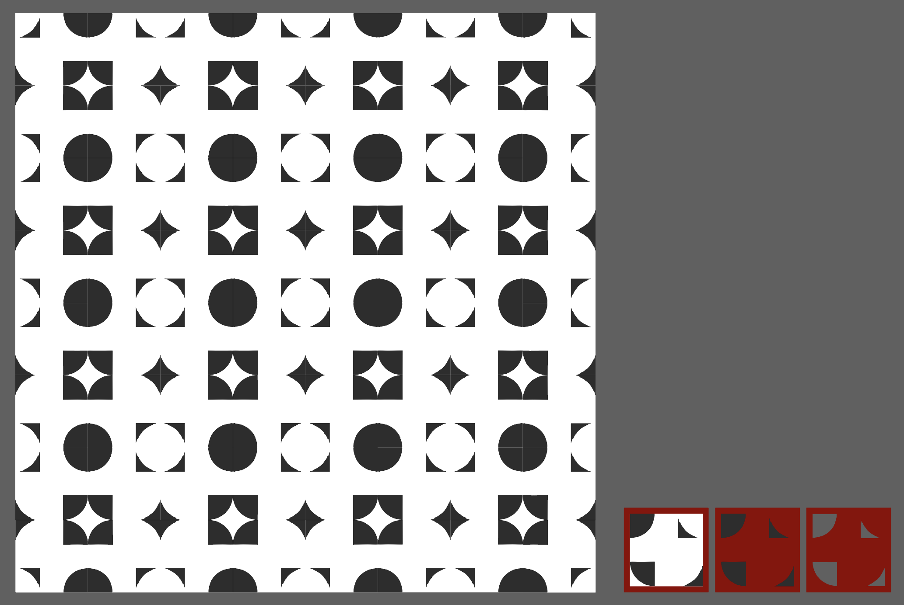

# tiledeco
A DIY ToolKit to design and decorate tiles and build unique pattern combinations

---
title: MDEF 22/23 - Tile Deco
---

###### tags: `MDEF` `Fab Lab Barcelona`

Challenge I: Tile Deco
==========================================
Caglar / Ahmed / Marc

**A DIY ToolKit to design and decorate tiles and build unique pattern combinations**
**"Playing in the physical and converting it to the digital"**

1. [**Project Alignment**](#1-Project-alignment)
2. [**Project Development**](#2-Project-development)
3. [**Final Product**](#3-Rethink-and-reconnect)

## #1 Project Alignment

We started sharing our interests and what fields we wanted to investigate to be able to implement them to our interventions. This three circles show the intersection between our main interests.

We defined the following concepts to start working:
1. DIY Projects
2. Fabrication
3. Modular
4. Digital Crafts
5. Making/Production
6. Gamification

From this concepts we defined that we wanted to explore the modularity of DIY design. How we can simplify a design process through a clear methodology combining physical and digital tools? We decided to do it through three stages:
Stage 1 - A 2D tile scale design pattern
Stage 2 - 3D facade iteration
Stage 3 - Public installation

**References**
We investigated some projects to take a look of what is already done and what we can contribute on. Also looking in different fields made us get inspired and develop our idea. Here we link some interesting projects:

[Tangram](https://en.wikipedia.org/wiki/Tangram)

[Bussoga](https://www.bussoga.com/en/tiling/)

[Letters, Words, Numbers](https://www.instagram.com/p/CnM4iamOt5A/)

[Cèrcol](https://www.instagram.com/p/CEww6dRKY10/)

[Socialist Modernism in Germany](https://www.instagram.com/p/CgcPF26MuKQ/)

[The key is to tell the tile setter not to worry about it - Jeff Shelton](https://www.instagram.com/p/CkeAuX7jl4E/)

First Iteration

As a group, after discussing about our common interest and as we want to work on water bricks to store domestic grey water, we decided to work on something related to modularity, interchangeability, personalisation of a product… We ended up with the idea of building a DIY toolkit which provides designing unique tile decorations and patterns made of those.

## #2 Project Development

Firstly, we talked on 3D and 2D options and then we decided to focus on 2D option. For a simple tile decoration we need vinyl designs which needs to be sticked on stencil to transfer the ceramic ink. Instead of providing ready to use patterns, stickers, vinyls we preferred to work on a grid board which provides the user to make their own unique design.

Tile-Deco is a concept of grid that made of acrylic and magnets and has geometric pieces which can be located on and stick by magnets to the grid in order to form various tile decorations.

**Design Process**
1. Grid board
2. Geometric pieces
3. Pattern design
4. Photo digitalisation (vector)
5. Vinyl cutting
6. Stencil
7. Tile production
8. Building pattern

[Design Process Presentation](https://www.canva.com/design/DAFavYB6CeY/SDjOxHvMFFO4icoWGjks5A/view)

1. **Grid Board**
A "DIY Tool Kit" to decorate tiles and build unique patterns and combinations.  

Through the design process of the grid board we tried to prevent from shades and reflections which ruins the quality of the photo-digitalisation process of the vinyl. But, as the acrylic thickness and magnet sizes are defined, we couldn’t avoid from that. On the other hand, we covered the acrylic surfaces with a mat vinyl to prevent the reflections. At least we succeeded to get rid of the reflections to enhance the quality of the photo-digitalisation process. But, of course the transfer of the vinyl on the grid board was not easy, we were not satisfied with the first attempt and for the second one magnets destroyed the grid engraved vinyl and fortunately we satisfied with the third vinyl design.

2. **Geometric pieces**

Another problem that we faced with was the unsuitability of some geometric pieces which helps to generate the tile decoration design. Some geometric items has only a single magnet on them and this cause a unstable position on the gird. (During the presentation one of the constructive critic was to make the grid board double size in order tom prevent this problem, this could be a perfect solution for the problem)

3. **Tile design**

The next step was making the patterns aligned with the photo-digitalisation process. As we took some tile decoration samples photos and we also worked on the various patterns options on 2D softwares. We used Illustrator and Inkscape to generate some patterns.

4. **Photo digitalisation (vector)**

The process of digitalization is a fascinating journey! After experimenting with various modules and testing different iterations, we decided to transition from an analogue, physical process to a digital process. To get started, we placed the tile in a well-lit environment, preferably with ambient lighting, to avoid shadows. A softbox proved to be a valuable tool to ensure the best possible scan results (and you can even build one yourself if you're feeling adventurous!). Once we took the picture and adjusted the contrast levels (using whichever tool you have available - we used Photoshop, but GIMP or Pixlr are great free alternatives), we were able to proceed only after obtaining a full black and white image.

The next step involved uploading the image into vector-based software, such as Illustrator (or whichever tool you have available). Illustrator offers a built-in feature that enables image tracing to achieve a vectorized outcome. Although the results are not always perfect (and a lot of tweaking may be necessary), we were able to take the image trace and redraw it manually to achieve a cleaner stencil outline.

Once we obtained the outlines, it was a breeze to scale them accordingly (in our case, the tiles were 150mm x 150mm) and get the negatives of the shapes. It's also essential to mirror the shape to get the required pattern when applying ink.

Even though the process took us about an hour to complete, we are continually looking for ways to simplify the physical-to-digital step process so that anyone can do it from the comfort of their home. Furthermore, we aim to develop something that will enable users to visualize their patterns more quickly after getting aggregated.

5. **Vinyl cutting**

6. **Stencil**

7. **Tile Production**

[squeege video](https://drive.google.com/file/d/142wLPfG5fM5Mu-XErmbFKV-Zxnlya-bf/view)

8. **Building pattern**

## #3 Final Product

**Conclusion**

To sum up, the grid board building process was a good experience to use the laser cutter after designing that on Rhinoceros and worked on the technical details to get the best results with the magnets we had to locate on the grid. The final result can be improved by using a thinner and mat acrylic and also by using smaller magnets. This will prevent the shades during the photo-digitalisation process and improve the quality of the edges of the tile decorations. Additionally, building it double size will provide all geometric shapes which helps to build the tile decoration completely stable on the grid.

As a development plan; we can continue with 3D options but, we are not sure about how to integrate electronics on our project to develop for the next stages.
