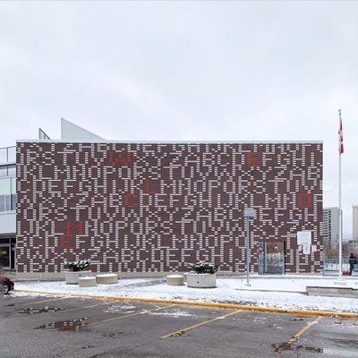

# tiledeco
A DIY ToolKit to design and decorate tiles and build unique pattern combinations

---
title: MDEF 22/23 - Tile Deco
---

###### tags: `MDEF` `Fab Lab Barcelona`

Challenge I: Tile Deco
==========================================
Caglar / Ahmed / Marc

**A DIY ToolKit to design and decorate tiles and build unique pattern combinations**
**"Playing in the physical and converting it to the digital"**

1. [**Project Alignment**](#1-Project-alignment)
2. [**Project Development**](#2-Project-development)
3. [**Final Product**](#3-Rethink-and-reconnect)

## #1 Project Alignment

We started sharing our interests and what fields we wanted to investigate to be able to implement them to our interventions. This three circles show the intersection between our main interests.

We defined the following concepts to start working:
1. DIY Projects
2. Fabrication
3. Modular
4. Digital Crafts
5. Making/Production
6. Gamification

From this concepts we defined that we wanted to explore the modularity of DIY design. How we can simplify a design process through a clear methodology combining physical and digital tools? We decided to do it through three stages:
Stage 1 - A 2D tile scale design pattern
Stage 2 - 3D facade iteration
Stage 3 - Public installation

**References**
We investigated some projects to take a look of what is already done and what we can contribute on. Also looking in different fields made us get inspired and develop our idea. Here we link some interesting projects:

[Tangram](https://en.wikipedia.org/wiki/Tangram)

[Bussoga](https://www.bussoga.com/en/tiling/)

[Letters, Words, Numbers](https://www.instagram.com/p/CnM4iamOt5A/)

[Cèrcol](https://www.instagram.com/p/CEww6dRKY10/)

[Socialist Modernism in Germany](https://www.instagram.com/p/CgcPF26MuKQ/)

[The key is to tell the tile setter not to worry about it - Jeff Shelton](https://www.instagram.com/p/CkeAuX7jl4E/)

First Iteration

## #2 Project Development

**Design Process**
1. Grid board
2. Geometric pieces
3. Pattern design
4. Photo digitalisation (vector)
5. Vinyl cutting
6. Stencil
7. Tile production
8. Building pattern

[Design Process Presentation](https://www.canva.com/design/DAFavYB6CeY/SDjOxHvMFFO4icoWGjks5A/view)

1. **Grid Board**
A "DIY Tool Kit" to decorate tiles and build unique patterns and combinations.  

2. **Geometric pieces**

3. **Tile design**

4. **Photo digitalisation (vector)**

5. **Vinyl cutting**

6. **Stencil**

7. **Tile Production**

[squeege video](https://drive.google.com/file/d/142wLPfG5fM5Mu-XErmbFKV-Zxnlya-bf/view)

8. **Building pattern**

## #3 Final Product
